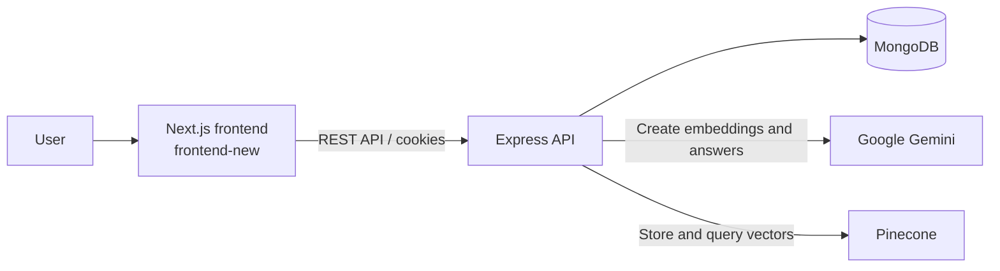

# Second Brain (Brain Dock)

[](https://github.com/Vishesh-Verma-07/SecondBrain/actions/workflows/ci.yml)
[](https://nextjs.org/)
[](https://nodejs.org/)
[](https://www.typescriptlang.org/)
[](https://opensource.org/license/isc-license-txt/)

Second Brain, presented in the product as **Brain Dock**, is a personal knowledge-management application for saving notes, links, and YouTube videos in one searchable workspace. It organises saved content with collections and tags, supports public share links, and uses AI-powered semantic search to return grounded answers from a user's own knowledge.

## Demo

Live deployment: [secondbrain.visheshxdevs.in](https://secondbrain.visheshxdevs.in)

## Features

- Account registration and sign-in with JWT-backed HTTP-only cookies
- Save notes, links, and supported YouTube videos
- Organise saved items with collections and tags
- Browse, filter, sort, inspect, and delete saved content
- Create and revoke public links for an entire knowledge workspace
- Semantic search over personal content using vector embeddings
- AI-generated, context-aware summaries of relevant saved items
- Health-check endpoint for service monitoring

## Tech Stack

- **Frontend:** Next.js 16, React 19, TypeScript, Lucide
- **Backend:** Node.js, Express, TypeScript, Zod
- **Data:** MongoDB, Mongoose, Pinecone vector database
- **AI:** Google Gemini, LangChain
- **Authentication:** JSON Web Tokens, bcrypt, cookie-parser
- **DevOps:** Docker, Docker Compose, Kubernetes, GitHub Actions
- **Code quality:** ESLint, Prettier

## Architecture



## Project Structure

```text
.
├── backend/                    # Express API and AI/search integrations
│   ├── src/
│   │   ├── controller/         # Request handlers
│   │   ├── db/                 # MongoDB connection
│   │   ├── middlewares/        # Authentication middleware
│   │   ├── models/             # Mongoose models
│   │   ├── routes/             # API routes
│   │   └── utility/            # Shared helpers and response utilities
│   ├── Dockerfile
│   └── package.json
├── frontend-new/               # Active Next.js frontend
│   ├── src/app/                # Pages, layouts, and styles
│   ├── src/lib/api.ts          # Frontend API client
│   ├── public/                 # Static assets
│   ├── Dockerfile
│   └── package.json
├── kubernetes/                 # Namespace, services, deployments, ingress
├── .github/workflows/ci.yml    # Continuous integration workflow
└── docker-compose.yml          # Local multi-container setup
```

> The legacy `frontend/` directory is intentionally not part of the active application. The current frontend is `frontend-new/`.

## Installation

### Prerequisites

- Node.js 20+
- npm
- MongoDB, or Docker for the Compose setup
- Google Gemini and Pinecone credentials for semantic search

Clone the repository and install dependencies for both services:

```bash
git clone https://github.com/Vishesh-Verma-07/SecondBrain.git
cd SecondBrain

cd backend
npm install

cd ../frontend-new
npm install
```

## Environment Variables

Create `backend/.env`:

```env
# Server
PORT=8080

# Database and authentication
MONGO_URI=mongodb+srv://<username>:<password>@<cluster>/<database>
JWT_SECRETE=replace-with-a-long-random-secret

# Google Gemini
GEMINI_API_KEY=your-gemini-api-key

# Pinecone vector search
PINECONE_API_KEY=your-pinecone-api-key
PINECONE_INDEX_NAME=your-index-name
PINECONE_URL=your-index-host-url
```

Create `frontend-new/.env`:

```env
NEXT_PUBLIC_API_URL=http://localhost:8080/api/v1
```

`NEXT_PUBLIC_API_URL` is embedded into the Next.js client at build time. Do not put secrets in frontend environment variables. The repository's existing backend environment also includes Google service-account variables; they are not used by the current application source.

## Usage

Run the API and frontend in separate terminals:

```bash
# Terminal 1
cd backend
npm run dev

# Terminal 2
cd frontend-new
npm run dev
```

Open `http://localhost:3000`. The API is available at `http://localhost:8080/api/v1`.

### Docker Compose

Docker Compose starts the active frontend, backend, and a MongoDB container:

```bash
docker compose up --build
```

The frontend is exposed at `http://localhost:3000`, the API at `http://localhost:8080`, and MongoDB at `localhost:27017`.

## Automation

GitHub Actions runs on pushes and pull requests to `main`. It installs dependencies, lints, and builds both `backend/` and `frontend-new/` using Node.js 20.

## Example Output

Check API availability with:

```bash
curl http://localhost:8080/api/v1/health
```

Example response:

```json
{
  "statusCode": 200,
  "data": {
    "status": "ok",
    "message": "Health check successful"
  }
}
```

## Configuration

- **Frontend API URL:** Set `NEXT_PUBLIC_API_URL` in `frontend-new/.env`.
- **Backend port:** Set `PORT` in `backend/.env`; Docker Compose uses port `8080`.
- **Allowed origins:** Update the `allowedOrigins` list in `backend/src/index.ts` when deploying the frontend to another domain.
- **Deployment manifests:** Kubernetes configuration is in `kubernetes/`, with ingress routing `/api` to the backend and all other traffic to the frontend.

## APIs & External Services

- [MongoDB](https://www.mongodb.com/) for persistent application data
- [Google Gemini](https://ai.google.dev/) for embeddings and generated search summaries
- [Pinecone](https://www.pinecone.io/) for vector storage and semantic retrieval
- [YouTube](https://www.youtube.com/) for embeddable video links

## Roadmap

- [ ] Add unit and integration tests for API routes and controllers
- [ ] Publish OpenAPI documentation
- [ ] Add configurable CORS origins and application port handling
- [ ] Keep Pinecone vectors synchronized when content is updated or deleted
- [ ] Add collection-level and item-level sharing
- [ ] Add rate limiting and structured application logging

## Contributing

Fork the repository, create a focused branch, make and test your change, then open a pull request that explains the problem and solution. Keep changes scoped and ensure both applications pass their lint and build checks.

## License

This project is licensed under the [ISC License](https://opensource.org/license/isc-license-txt/).

## Author

**Vishesh Verma** - Owner and author

## Acknowledgements

Built with Next.js, Express, MongoDB, Mongoose, LangChain, Google Gemini, Pinecone, Docker, and Kubernetes.
