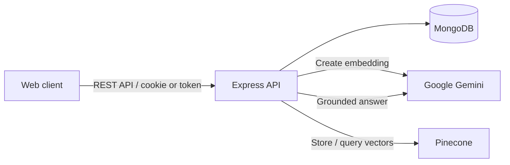

# Second Brain API

[](https://nodejs.org/)
[](https://www.typescriptlang.org/)
[](https://www.mongodb.com/)
[](https://opensource.org/license/isc-license-txt/)

The backend API for **Second Brain**, a personal knowledge-management application. It lets users store and organise links or notes into categories and tags, share a collection through a generated link, and search their saved knowledge semantically with AI-generated answers.

## Features

- User registration, sign-in, profile retrieval, update, and deletion
- HTTP-only cookie authentication with JWT support
- Create, retrieve, inspect, and delete saved content
- Automatic conversion of supported YouTube links to embed URLs
- Categories and tags for organising content
- Shareable brain links for accessing a user's saved content
- Semantic search powered by Gemini embeddings and Pinecone vector search
- Context-aware AI answers generated from matching saved content
- Health-check endpoint for service monitoring

## Tech Stack

- **Runtime & language:** Node.js, TypeScript
- **Web framework:** Express
- **Database:** MongoDB with Mongoose
- **Authentication:** JSON Web Tokens, bcrypt, cookie-parser
- **Validation:** Zod
- **AI & vector search:** Google Gemini, LangChain, Pinecone
- **Development tooling:** tsx, TypeScript compiler

## Architecture



## Project Structure

```text
backend/
├── src/
│   ├── controller/       # Request handlers
│   ├── db/               # MongoDB connection
│   ├── middlewares/      # Authentication middleware
│   ├── models/           # Mongoose schemas and models
│   ├── routes/           # API route definitions
│   ├── utility/          # Response and helper utilities
│   ├── embed.ts          # Gemini embedding generation
│   ├── lanchain.ts       # Gemini chat integration
│   ├── pinecone.ts       # Pinecone client and index access
│   └── index.ts          # Application entry point
├── package.json
└── tsconfig.json
```

## Installation

1. Clone the repository and open the backend directory.

   ```bash
   git clone <repository-url>
   cd secondBrainMain/backend
   ```

2. Install dependencies.

   ```bash
   npm install
   ```

3. Create a `.env` file using the variables below.

## Environment Variables

Create `backend/.env` and provide the following values:

```env
# MongoDB connection string
MONGO_URI=mongodb+srv://<username>:<password>@<cluster>/<database>

# Secret used to sign user JWTs
JWT_SECRETE=replace-with-a-long-random-secret

# Google AI Studio / Gemini API key
GEMINI_API_KEY=your-gemini-api-key

# Pinecone vector database configuration
PINECONE_API_KEY=your-pinecone-api-key
PINECONE_INDEX_NAME=your-index-name
PINECONE_URL=your-index-host-url
```

Never commit `.env` or expose credentials in client-side code.

## Usage

Start the API in development mode:

```bash
npm run dev
```

The server listens on `http://localhost:3000`. Build and run the compiled application with:

```bash
npm run build
npm start
```

### API Endpoints

All endpoints are prefixed with `/api/v1` unless noted otherwise. Protected routes require a JWT in the `token` request header or the authentication cookie returned by sign-in.

| Area | Endpoints |
| --- | --- |
| Health | `GET /api/v1/health` |
| Users | `POST /user/signup`, `POST /user/signin`, `GET /user/getUser`, `PUT /user/updateUser`, `DELETE /user/deleteUser` |
| Content | `POST /content/create`, `GET /content/getAll`, `GET /content/getPostDetail/:id`, `DELETE /content/deleteContent/:id` |
| Brain | `POST /brain/share`, `GET /brain/getBrain/:shareLink`, `POST /brain/search` |
| Categories | `POST /categories/createCategory`, `GET /categories/getAllCategories`, `GET /categories/getCategoryById/:categoryId`, `PUT /categories/updateCategory/:categoryId`, `DELETE /categories/deleteCategory/:categoryId` |
| Tags | `POST /tags/createTag`, `GET /tags/getAllTags`, `GET /tags/getTagById/:id`, `PUT /tags/updateTag/:id`, `DELETE /tags/deleteTag/:id` |

## Example Output

Verify that the service is running:

```bash
curl http://localhost:3000/api/v1/health
```

```json
{
  "statusCode": 200,
  "data": {
    "status": "ok",
    "message": "Health check successful",
    "data": {
      "timeStamp": "2026-07-16T10:00:00.000Z"
    }
  }
}
```

## Configuration

- **Port:** The API currently listens on port `3000`.
- **CORS:** Requests are allowed from `http://localhost:5173` and `https://secondbrain-vis.vercel.app`, with credentials enabled. Update `src/index.ts` to add another frontend origin.
- **Semantic search:** Pinecone queries return up to five nearest matches. Gemini's `gemini-embedding-001` model creates vectors, and `gemini-1.5-flash` produces grounded answers from the matched content.

## APIs & External Services

- [MongoDB](https://www.mongodb.com/) — primary application database
- [Google Gemini](https://ai.google.dev/) — text embeddings and answer generation
- [Pinecone](https://www.pinecone.io/) — vector storage and similarity search

## Roadmap

- [ ] Add automated tests for routes and controllers
- [ ] Add API documentation with an OpenAPI specification
- [ ] Make the port and CORS origins environment-configurable
- [ ] Add request rate limiting and structured logging
- [ ] Keep MongoDB and Pinecone data in sync when content is updated or deleted

## Contributing

Contributions are welcome. Fork the repository, create a focused branch, make and test your change, then open a pull request describing the problem and solution.

## License

This project is licensed under the [ISC License](https://opensource.org/license/isc-license-txt/).

## Acknowledgements

- [Express](https://expressjs.com/), [Mongoose](https://mongoosejs.com/), [LangChain](https://js.langchain.com/), and the Google Gemini and Pinecone SDKs.
